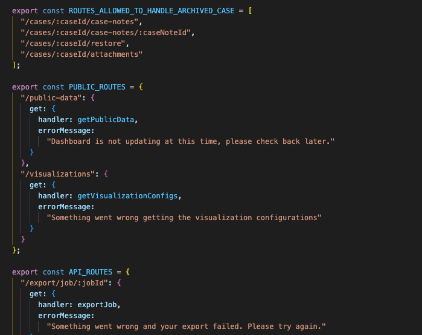
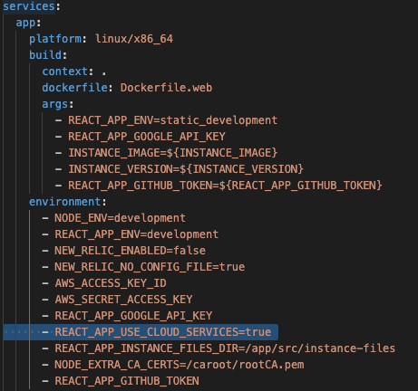

{: .highlight-title }
> Under Construction
>
> This page is under construction.

# How to Create a Public Service Handler

A public service handler is a handler that is meant to be called without any authorization. This is required for service handlers that are called from the public data dashboard, which is built to be used by anyone. Here's how you make sure that a call to that handler doesn't error out without authorization or redirect the user to a login page:

## Server Side

In `src/server/apiRoutes.js` make sure that you define the route in the `PUBLIC_ROUTES` constant rather than the `API_ROUTES` constant where the auth required handlers live. Also don't add a `requiredPermission` attribute, since that will require a permission.

<!-- TODO: Add alt text -->

## Client Side

Add the path to your handler in `src/client/common/axiosInterceptors/ensureTokenOnRequestInterceptor.js` in the `publicAPIs` array near the top. The server side change makes the handler accessible without auth, but if this client change is made, then the app will redirect to the auth page without ever calling the handler.

{: .note }
The public APIs start with `/api` for the most part, which means where the axios call is made, you need to start that uri with `/api` (rather than `api`) or it will not recognize the endpoint as public

<!-- TODO: Add alt text -->

## Testing Auth in Local

If you have already pushed to CI and are only now realizing you have a problem and are thinking "why didn't I see this in local?!" it's because by default we turn auth off for local, but you can turn it on by flipping `REACT_APP_USE_CLOUD_SERVICES` to `true` in `docker-compose.yml` under `services.app.environment`. You'll need to do a down and up after this change for it to take effect. After you do that, it should be as simple as making sure you're not logged in and then navigating to the public data dashboard (`/data`) or wherever you need to go to hit the handler and see if it redirects you or fails. Make sure to switch the flag back to `false` before committing.

<!-- TODO: Add alt text -->
